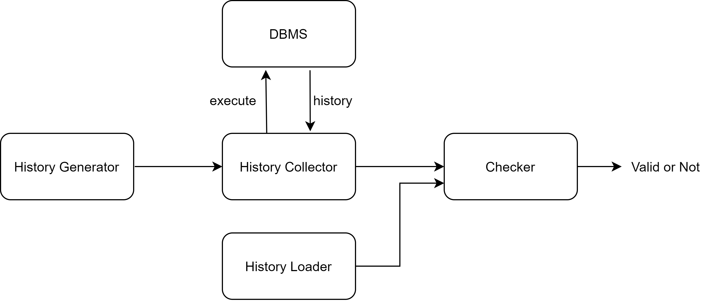

# 项目简介
DBTest 是一个用于黑盒测试数据库事务隔离级别的平台。通过集成多种隔离级别的测试方法，可以方便快捷地对各种数据库进行测试。同时也支持对测试方法进行性能分析。总之，DBTest 具有高度可扩展性和出色的易用性。

本平台大致的架构如下：



# 支持

## 数据库

目前支持如下数据库，可以使用 [scripts/](scripts/) 目录下的 docker-compose 文件快速部署数据库进行测试（目前支持部署单机版数据库）：

- MySQL
- PostgreSQL
- H2

## 工作负载

目前支持如下的工作负载：

| 工作负载 | 描述                                                         |
| -------- | ------------------------------------------------------------ |
| GENERAL  | 模拟多个会话并发访问数据库产生的工作负载。使用模拟会话数、每个会话的事务数、每个事务的操作数、读操作比例、工作负载键的数量和事务访问键的分布类型这些参数随机生成。 |
| TPCC     | TODO                                                         |

## 一致性检测算法

目前支持如下一致性检测算法和对应的隔离级别：

| Checker | 支持检测的隔离级别                                     |
| ------- | ------------------------------------------------------ |
| C4      | READ_COMMITTED<br>READ_ATOMICITY<br>CAUSAL_CONSISTENCY |
| PolySI  | SNAPSHOT_ISOLATION                                     |

# 构建方式

要编译 DBTest，需要具备以下环境：
- JDK 11
- Maven
- Git

执行以下命令可编译 DBTest 的源代码：
```shell
git clone https://github.com/hengxin/db-testing-platform
cd db-testing-platform
mvn clean package
```
然后可以在 `target` 目录下找到编译好的 `shaded jar` 文件。

# 运行

## 参数设置
由于运行参数较多，所有参数均放在 `config.properties` 之中。以下是各个运行参数的详细解释：

### 数据库连接

```
db.url= # JDBC URL
db.username= # 用户名
db.password= # 密码
db.isolation= # 事务隔离级别
db.type= # 数据库类型，支持 MYSQL、POSTGRESQL 和 H2
```
### 通用工作负载配置

```
workload.type= # 工作负载类型，现在只支持 general，后续计划添加支持 TPCC 等
workload.history= # 历史事务数
workload.session= # 模拟会话数
workload.transaction= # 每个会话的事务数
workload.operation= # 每个事务的操作数
workload.readproportion= # 读操作比例
workload.key= # 工作负载键的数量
workload.distribution= # 事务访问键的分布类型，支持 uniform、 zipfan 和 hotspot
```
### 检查器配置

```
checker.type= # 一致性检测算法类型，支持 C4 和 PolySI
checker.isolation= # 一致性检测算法的隔离级别，支持 READ_COMMITTED、READ_ATOMICITY、CAUSAL_CONSISTENCY 和 SNAPSHOT_ISOLATION
```

### 性能分析工具配置
```
profiler.enable= # 是否启用性能分析，true/false
```

可以使用 `workload.variable` 指定一个 `workload` 参数，配合 `profiler` 进行对 `checker` 的性能分析，比如：

```
workload.history=3
workload.session=[2,5,10,20,30]
workload.variable=workload.session
profiler.enable=true
```

 在运行这个配置文件后会在 `result/` 目录下得到一个 `profiling_{timestamp}.csv` 文件，包含检测算法的运行时数据，比如：

| sessions | time (ms) | memory (MB) |
| -------- | --------- | ----------- |
| 2        | 7         | 34.2        |
| 5        | 8         | 41.2        |
| 10       | 11        | 52.2        |
| 20       | 30        | 71.7        |
| 30       | 38        | 93.2        |

## 运行方法

编译完成后，可以用以下命令运行 DBTest：
```shell
java -jar ./target/DBTest-1.0-SNAPSHOT-shaded.jar config.properties
```

由于 PolySI 依赖 monoSAT，所以在运行 PolySI 时可能会看到如下链接错误：

```
Exception in thread "main" java.lang.UnsatisfiedLinkError: no monosat in java.library.path: /usr/java/packages/lib:/usr/lib64:/lib64:/lib:/usr/lib
```

可以添加 JVM 参数 `-Djava.library.path=src/main/resource/libmonosat.so` 或者将 `src/main/resource/libmonosat.so` 添加到 `java.library.path` 中的一个目录下。如果本仓库提供的 `libmonosat.so` 无法在你的环境上运行，请自己使用 [monoSAT 源码](https://github.com/sambayless/monosat)编译。

# 平台扩展
## 历史
`History` 类表示一个数据库运行的历史记录，包含了一系列的会话和事务。每个会话包含多个事务，每个事务包含多个操作。此外，还包含了一些被中止的写操作（用于加速检测 aborted writes）。`History` 的相关实现会使用到 `Operation`、`Session` 以及 `Transaction` 类，并且通过 `loader` 加载，使用 `serializer` 序列化。

**字段说明**

- `Map<Long, Session<KeyType， ValType>> sessions`：存储所有会话的映射，其键是会话的 ID，值是对应的 `Session` 对象。
- `Map<Long, Transaction<KeyType， ValType>> transactions`：存储所有事务的映射，其键是事务的 ID，值是对应的 `Transaction` 对象。
- `Set<Pair<KeyType, ValType>> abortedWrites`：存储所有被中止的写操作。每个中止的写操作表示为一个键值对。

**方法**

- `Session<KeyType， ValType> getSession(long id)`：根据给定的 ID 返回对应的会话。
- `Transaction<KeyType， ValType> getTransaction(long id)`：根据给定的 ID 返回对应的事务。
- `Session<KeyType， ValType> addSession(long id)`：添加一个新的会话并返回它。新会话的 ID 是给定的参数。
- `Transaction<KeyType， ValType> addTransaction(Session<KeyType， ValType> session， long id)`：在给定的会话中添加一个新的事务并返回它。新事务的 ID 是给定的参数。
- `Operation<KeyType， ValType> addOperation(Transaction<KeyType， ValType> transaction， Operation.Type type， KeyType variable， ValType value)`：在给定的事务中添加一个新的操作并返回它。新操作的类型、变量和值是给定的参数。
- `void addAbortedWrite(KeyType variable， ValType value)`：添加一个新的被中止的写操作。被中止的写操作的变量和值是给定的参数。
- `List<Operation<KeyType， ValType>> getOperations()`：返回所有操作的列表。
- `List<Transaction<KeyType， ValType>> getFlatTransactions()`：返回所有事务的列表。这个列表是按照会话和事务的顺序排列的。

### 文本格式的历史

目前，平台实现了文本格式历史的加载和序列化。一个文本格式的历史文件的一行如下：

`r/w(key,value,sessId,txnId)`

每个字段的含义如下：

- `r/w`：表示这是一个读/写操作
- `key`：读取或写入的键
- `value`：读取或写入的值，如果读之前没有写入则为0
- `sessId`：这个操作所在会话的编号
- `txnId`：这个操作所在事务的编号

## Checker

`Checker` 是一个Java接口，它定义了一个验证方法 `verify()`，该方法接受一个 `History` 对象，并返回一个布尔值。`History` 对象通常代表特定类型的键值对（`KeyType` 和 `ValType`）的历史记录。

除了实现 `Checker` 接口之外，还需要在实现类中定义如下字段用于平台启动时扫描到实现类并根据配置文件选择实现类：

```java
public static final String NAME = "C4";
public static IsolationLevel ISOLATION_LEVEL;
```

具体实现可以参考 [C4](src/main/java/checker/C4/C4.java)。

## 数据库
### 当前支持种类
目前平台已经支持 MySQL、Postgres 以及 H2 数据库的测试，可以使用 [scripts/](scripts/) 目录下的 docker-compose 文件快速部署数据库进行测试（目前支持部署单机版数据库）。

### 扩展支持的数据库类型
有关与数据库交互收集历史的代码在 `src/main/java/collector` 目录下。如果需要添加对一个新的数据库的支持，需要完成两部分代码：`Client` 和 `Collector`。
#### Client
DBClient 用于定义数据库客户端的通用逻辑框架。它包含了数据库连接信息的属性，并在构造函数中初始化数据库连接。定义了一个抽象方法 `execSession()`，由子类实现，用于执行给定的会话操作。

**字段说明**

- `String url`：数据库的URL。
- `String username`：用于数据库连接的用户名。
- `String password`：用于数据库连接的密码。
- `Connection connection`：数据库连接对象，由 `java.sql.Connection` 类型实例化。
- `int maxRestartTimes`：最大重启次数，默认值为1000。

**构造函数**
`DBClient(String url, String username, String password)`：构造函数接收数据库的URL、用户名和密码作为参数，并使用这些信息建立数据库连接。如果连接失败，将抛出异常。

**抽象方法**
`void execSession(Session<Long, Long> session)`：一个抽象方法，用于执行特定的数据库会话。这个方法的实现应该在 `DBClient` 的具体子类中提供。

详细实现方法可参考`mysql/MySQLClient`或`postgresql/PostgreSQLClient`
#### Collector
`Collector` 用于定义收集历史记录的模版方法。提供了创建表、创建变量、删除数据库等抽象方法， 由子类实现具体的数据库操作。

**字段说明**
- `String url`：数据库的URL。
- `String username`：用于数据库连接的用户名。
- `String password`：用于数据库连接的密码。
- `Connection connection`：数据库连接对象，由 `java.sql.Connection` 类型实例化。
- `long nKey`：工作负载的键值。

**构造函数**
`Collector(Properties config)`：构造函数接收一个 `Properties` 对象作为参数，该对象包含数据库连接的详细信息和工作负载的键值。这些信息包含在 `Properties` 对象的属性中，属性的键分别是 `"db.url"`、`"db.username"`、`"db.password"` 和 `"workload.key"`。构造函数使用这些信息建立数据库连接并设置工作负载的键值。

**抽象方法**
- `History<KeyType, ValType> collect(History<KeyType, ValType> history)`：一个抽象方法，用于收集数据库中的历史记录。这个方法的实现应该在 `Collector` 类的具体子类中提供。
- `void createTable()`：一个抽象方法，用于在数据库中创建表。这个方法的实现应该在 `Collector` 类的具体子类中提供。
- `void createVariables(long nKey)`：一个抽象方法，用于创建变量。这个方法的实现应该在 `Collector` 类的具体子类中提供。
- `void dropDatabase()`：一个抽象方法，用于删除数据库。这个方法的实现应该在 `Collector` 类的具体子类中提供。

详细实现方法可参考`mysql/MySQLCollector`或`postgresql/PostgreSQLCollector`

## 扩展历史生成
需要在`generator/`下完成对应历史的生成，可参考以下`GeneralGenerator`实现

**字段说明**

- `long session, transaction, operation, key`：从配置文件中获取的会话数量、事务数量、操作数量和键值。
- `double readProportion`：读取比例，从配置文件中获取。
- `IntegerDistribution keyDistribution`：键值的分布方式，可以是均匀分布 (`UniformIntegerDistribution`)、Zipf 分布 (`ZipfDistribution`) 或热点分布 (`HotspotIntegerDistribution`)。
- `BernoulliDistribution readProbability`：读取概率，由读取比例计算得出。

**构造函数**
`GeneralGenerator(Properties config)`：构造函数接收一个 `Properties` 对象作为参数，该对象包含生成历史记录所需的各种配置参数。这些参数包括会话数量(`workload.session`)、事务数量(`workload.transaction`)、操作数量(`workload.operation`)、读取比例(`workload.readproportion`)、键值(`workload.key`)和键值分布方式(`workload.distribution`)。

**方法**
`History<Long, Long> generate()`：根据指定的参数生成历史记录。首先，创建一个空的 `History` 对象和一个用于计数的 `ConcurrentHashMap`。然后，为每个会话创建一个任务，每个任务生成指定数量的事务，每个事务生成指定数量的操作。操作类型可以是读取或写入，根据读取概率随机确定。对于写入操作，还会更新计数器。所有任务在一个固定大小的线程池中并发执行。最后，返回生成的历史记录。

